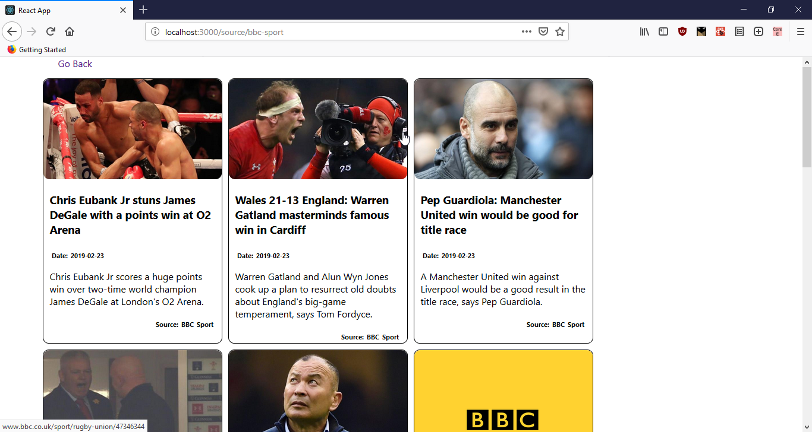
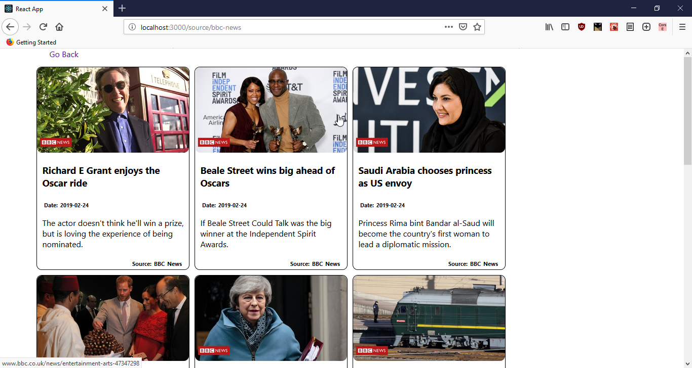
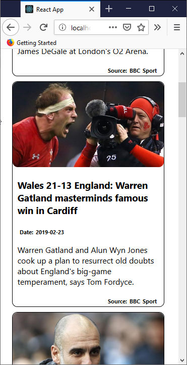
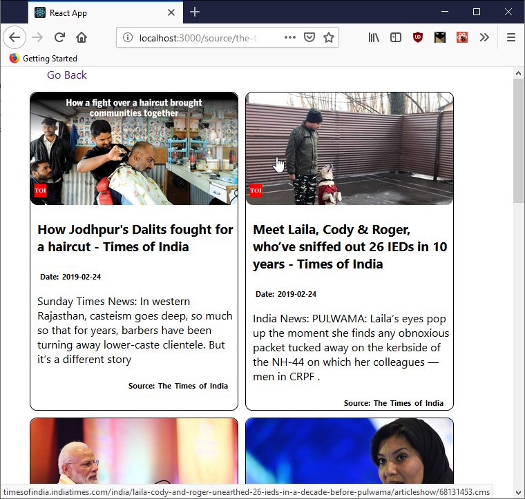
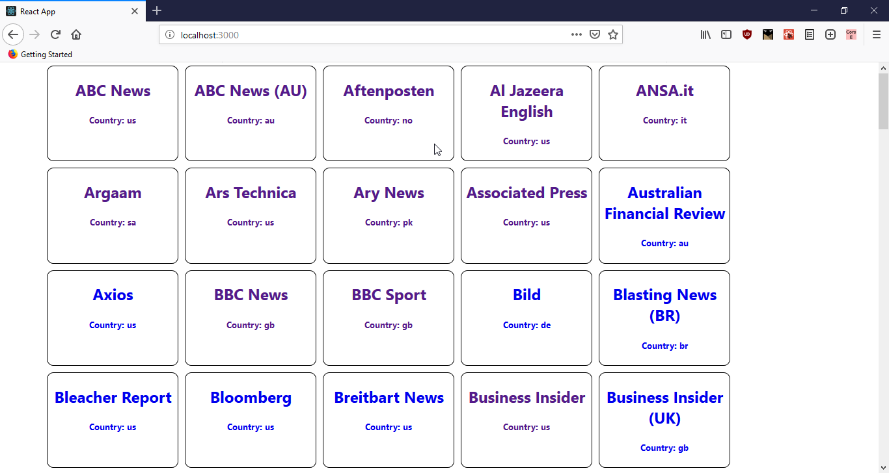

<h1>NewsX</h1>
<h4>A New Age News Reading application</h4>

<h3>HOW TO USE INSTRUCTIONS!!</h3>

	<ol>
		<li>Go to <a href="https://newsapi.org/"> newsAPI </a></li>
		<li>Click Get API key and generate your own unique API key</li>
		<li>copy the generated API key and </li>
		<li>paste it in <h6>"APIKEY = -paste-your-value-here"</h6> in ./src/api.js file</li>
		<li>Run the Project and give me feedbacks!</li>
	</ol>

Link to Project 

A React Framework based News reading Application which let's you 
read news from a variety of sources from all around the world.

The Features include

<ul>
	<li>Select News from World Wide Sources</li>
	<li> Clean Card based UI </li>
	<li> Provides Daily Top Headlines from your favorate News Source </li>
	<li> Proves News Brief for selected News</li>
	<li> Redirects Users to the Full News Article</li> 
</ul>

<label>BBC Sports news Screen</label>
	

<label>BBC news Screen</label>
	

<label>Mobile BBC news Screen</label>
	

<label>Tab TOI news Screen</label>
	

<label>News Selection Screen</label>

